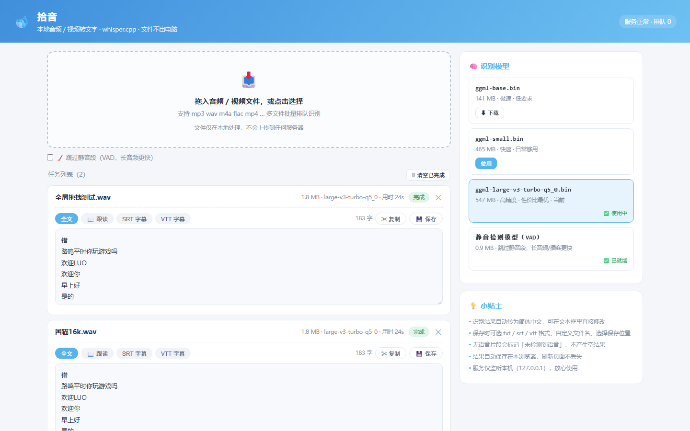

# 拾音 · 本地音频/视频转文字

[](LICENSE)
[](RELEASE.md)

> 版本状态：**v0.4.0 · 【可用】**（2026-09-01 开源定版，本地实测功能全通）。0.x 为迭代期语义——功能仍在演进、未承诺稳定，不代表质量问题。
> 反哺通道：自用分支「视频蒸馏」已验证的增强（B站官方 API 直连 + 字幕优先、输出目录可配置、风控韧性）将视情况反哺回本仓库。
[](package.json)
[](https://github.com/x1303145921/shiyin/actions/workflows/ci.yml)

> 开口即录，落笔成文 —— 文件不出电脑的语音转文字工具。

**拾音（shiyin）** 是一个纯本地、离线运行的音频/视频转文字工具，基于 [whisper.cpp](https://github.com/ggerganov/whisper.cpp) 语音识别引擎。你的音频文件**不会上传到任何服务器**——识别全程在本机完成，适合会议录音、课程笔记、访谈整理等重视隐私的场景。

- **纯本地**：服务仅监听 `127.0.0.1`，文件与模型均不出电脑
- **网页界面**：双击启动，浏览器即用，零安装依赖（需 Node.js 18+）
- **三种输出**：txt / srt / vtt 字幕格式一键切换、在线编辑、即改即存
- **字幕跟读**：内置播放器 + 字幕段落点击跳转，跟读学习两相宜
- **模型自由**：极速/均衡/高精度三档模型，面板一键下载切换

## ✨ 功能特性

| 特性 | 说明 |
|---|---|
| 🎙 **whisper.cpp 本地识别** | 音频/视频直接转文字，全程离线，文件不出电脑 |
| 📝 **三格式输出** | 全文 txt / 字幕 srt / 网页字幕 vtt，一键切换、在线编辑即存 |
| 📖 **字幕跟读** | 内置播放器 + 字幕段落列表，点击任意行精确跳转（误差 < 0.3s），当前行自动高亮，空格播放/暂停，支持音视频 |
| 🧹 **VAD 静音跳过** | 可选启用 Silero VAD，自动跳过静音段，长音频/播客显著加速，减少环境声幻觉 |
| 🧠 **重复幻觉修复** | 内置双重后处理：相邻重复段落合并 + 段内同一词重复收缩（真实音频验证：重复 40 次 → 1 次） |
| ⏱ **跳过转码提速** | 已是 16kHz 单声道 WAV 的文件直接识别，跳过 ffmpeg 预处理（秒级探测） |
| 🖱 **全局拖拽上传** | 文件拖到页面任意位置即可上传，实时进度条 + 前后端双层格式校验 |
| ↻ **失败一键重试** | 转写失败卡片一键重试，原始媒体保留期内直接复用，无需重新上传 |
| 🎚 **模型管理面板** | 极速 base / 均衡 small / 高精度 turbo 三档，一键下载、切换、删除（hf-mirror.com 镜像） |
| 🔔 **后台完成提醒** | 页面在后台时识别完成自动闪烁标签页标题 |
| 📊 **列表接口瘦身** | 任务多时按需拉取详情，长列表不卡顿 |
| ⏳ **转写耗时显示** | 完成卡片显示实际用时（60s 音频本地 CPU 约 20~30s） |
| 📦 **PWA 可安装** | 支持安装到桌面/任务栏，独立窗口运行 |

## 🖼 界面预览



## ⬇️ 下载

| 方式 | 适合谁 | 操作 |
|---|---|---|
| **git clone** | 想直接用的所有人 | `git clone https://github.com/x1303145921/shiyin.git` |
| **源码 ZIP** | 只想先看看 | 仓库页面绿色 `Code` 按钮 → `Download ZIP` |
| **Releases** | 追版本更新 | [Releases 页面](https://github.com/x1303145921/shiyin/releases)（含源码包与发布说明） |

> 💡 拾音依赖 Node.js 18+（[官方下载](https://nodejs.org/zh-cn/download)）；whisper 模型约 141~547 MB，首次使用时在「模型管理」面板一键下载。

## 🚀 快速开始（Windows 小白版）

### 第 1 步：准备

安装 [Node.js 18+](https://nodejs.org/zh-cn/download)（一路下一步即可）。

### 第 2 步：启动

双击 `启动拾音.bat` —— 服务自动在后台启动，浏览器自动打开 `http://127.0.0.1:18900`。

> 想固定在桌面？双击 `安装到桌面.bat`，自动生成「拾音」快捷方式（含新图标）。
> 想关闭服务？双击 `停止拾音.bat`（按端口精确停止，不误伤其它程序）。

### 第 3 步：使用

1. 首次使用先到右侧「模型管理」面板下载一个模型（推荐 **turbo**，性价比最优；日常快速用 **small**）
2. 把音频/视频文件拖进页面（或点击选择文件），选好模型与 VAD 选项
3. 点击「开始识别」——完成后即可查看/编辑全文与字幕，或保存文件

### 其他平台（macOS / Linux）

```bash
npm install          # 安装依赖（express / multer / chinese-conv）
npm start            # 启动服务 → 浏览器打开 http://127.0.0.1:18900
```

## 🎙 模型管理

| 模型 | 大小 | 定位 |
|---|---|---|
| `ggml-base.bin` | 141 MB | 极速 · 低要求设备 |
| `ggml-small.bin` | 465 MB | 快速 · 日常够用 |
| `ggml-large-v3-turbo-q5_0.bin` | 547 MB | 高精度 · 性价比最优（推荐） |

- 模型从 Hugging Face 官方镜像（hf-mirror.com）下载，下载时校验 SHA256
- 缓存目录：`D:\shiyin-cache\models`（可通过服务端配置调整）
- 切换模型即时生效，无需重启服务

## 🔌 API 参考

服务默认监听 `127.0.0.1:18900`，前端即调用以下接口（也可供脚本自动化使用）：

| 方法 | 路径 | 说明 |
|---|---|---|
| POST | `/api/transcribe` | 上传音频/视频并创建转写任务（multipart，字段 `file`） |
| GET | `/api/tasks` | 任务列表（含 VAD/模型/时长等元信息，不含字幕大字段，按需拉详情） |
| GET | `/api/task/:id` | 任务详情（含 txt / srt / vtt 全文与媒体信息） |
| POST | `/api/task/:id/retry` | 失败任务重试（保留原始媒体，无需重新上传） |
| GET | `/api/models` | 模型列表与下载/激活状态 |
| POST | `/api/models/use` | 切换当前使用的模型 |
| POST | `/api/models/download` | 下载模型（body: `{ "name": "ggml-small.bin" }`） |
| POST | `/api/vad/download` | 下载 Silero VAD 静音检测模型 |

## 🛠 开发与构建

```bash
# 语法检查（服务端 + 图标渲染/打包脚本）
node --check server.js
node --check scripts/render-icon.js
node --check scripts/build-ico.js

# 启动开发服务
npm start

# 图标（用户提供的麦克风图标，源文件 public/icon-source.webp）：
#   缩放各尺寸（ffmpeg lanczos）→ 打包 ICO：node scripts/build-ico.js work-ico public/app-icon.ico 16,32,48,64,128,256
#   缩放各尺寸（ffmpeg）→ 打包 ICO：node scripts/build-ico.js work-ico public/app-icon.ico 16,32,48,64,128,256
#   （渲染/打包链路细节见 scripts/ 内文件头注释与 CHANGELOG v0.4.0）
```

## 📁 项目结构

```text
拾音/
├── server.js               # 服务端（Express：上传/任务/模型/转写队列）
├── public/                 # 前端（原生 HTML/CSS/JS + PWA）
│   ├── index.html          # 主页面（拖拽上传/任务卡片/模型面板/跟读播放器）
│   ├── service-worker.js   # PWA 缓存（shiyin-v4，图标换新需 bump 版本）
│   ├── manifest.json       # PWA 清单（名称/主题色/图标）
│   └── icon-source.webp    # 图标源文件（用户提供，麦克风图标）
├── scripts/                # 工具脚本
│   ├── render-icon.js      # CDP 透明背景图标渲染（零依赖，Node 21+）
│   └── build-ico.js        # 手写 ICO 打包（ICONDIR + PNG 条目）
├── assets/                 # 截图与视觉资料
├── test-audio/             # 本地测试音频（不入库）
├── 启动拾音.bat            # Windows 启动器
├── 停止拾音.bat            # Windows 停止器（按端口精确停止）
├── 安装到桌面.bat          # 桌面快捷方式 + 图标缓存刷新
├── package.json / LICENSE / CHANGELOG.md / README.md / ...
```

## ❓ 常见问题（FAQ）

| 问题 | 解答 |
|---|---|
| **打不开页面？** | 确认已安装 Node.js 18+；双击 `启动拾音.bat` 后浏览器地址栏输入 `http://127.0.0.1:18900` |
| **识别速度慢？** | 本地 CPU 转写约为实时语速的 2~4 倍（60s 音频约 20~30s），属正常；可换 small 模型提速，或开启「跳过静音段」（VAD） |
| **识别结果有重复？** | 已内置重复幻觉修复；若仍出现，可在 GitHub Issues 附上音频特征描述（时长/环境/口音），我们针对性优化 |
| **模型下载失败？** | 模型来自 hf-mirror.com 镜像；可稍后重试，或手动放置模型文件到缓存目录 `D:\shiyin-cache\models` |
| **浏览器图标还是旧的？** | 强制刷新：浏览器 Ctrl+F5；PWA 固定图标需取消固定再重新固定；Windows 桌面图标残留请重跑 `安装到桌面.bat`（自动刷新图标缓存） |
| **支持哪些格式？** | 常见音视频格式均可（wav/mp3/m4a/flac/mp4/mkv/avi 等，内部经 ffmpeg 处理）；已是 16kHz 单声道 WAV 时跳过转码直识别 |
| **能识别方言/英文吗？** | 默认中文（`-l zh`）；whisper.cpp 支持多语言，可通过服务端参数调整 |
| **会联网吗？** | 仅下载模型时联网（hf-mirror.com）；转写全程离线，音频不出电脑 |

## 🔒 隐私与安全

- 服务仅监听 `127.0.0.1`，不对外网开放；请勿修改监听地址暴露到局域网/公网
- 上传文件与转写中间产物在任务生命周期结束后自动清理
- 前端不依赖任何第三方 CDN，无外部脚本注入面
- 完整安全边界见 [SECURITY.md](SECURITY.md)

## 📜 许可证

[MIT License](LICENSE) © 2026 颜（x1303145921）

---

*拾音 —— 灯下拾音，纸上落字。*
